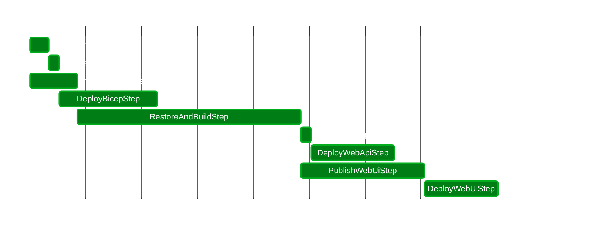

# ParallelPipelines

⭐ Write your CICD orchestration with C#!

| ParallelPipelines                                                                      | Github Actions                         |
|----------------------------------------------------------------------------------------|----------------------------------------|
| ✅ Parallel steps                                                                       | ❌ Sequential steps                     |
| ✅ Run locally to rapidly prototype and debug                                           | ❌ Difficult to run locally, accurately |
| ✅ Interactive progress running locally                                                 | ❌ -                                    |
| ✅ Outputs a summary table and gantt chart of deployment to Github Actions Step Summary | 🟨 Run summary                         |
| ❌ Cannot rerun failed jobs (restart in progress run)                                   | ✅ Rerun failed jobs                    |
| ✅ C# and strong types                                                                  | ❌ YAML                                 |

Despite the comparison, ParallelPipelines is built primarily to be used in Github Actions. Bitbucket Pipelines/Azure Pipelines may be officially supported in the future if there is interest.

## Getting Started

- Copy and update as needed the [Github workflow examples](./samples/Github%20Workflows) folder to your repository
- Create a new C# Project for CICD, and install the [ParallelPipelines Nuget package](https://www.nuget.org/packages/ParallelPipelines/)
- Create some steps! See the [examplesrc/ParallelPipelines.Console/Steps](./examplesrc/ParallelPipelines.Console/Steps) folder for examples
- Test your CICD locally with `dotnet run`
- Ensure the path to your `Deploy` project is correct in the Github workflow
- Done!

### Notes Regarding Examples

- The examples are written with a C#/.NET/Azure ecosystem in mind, noting steps such as installing dotnet wasm-tools, installing the Azure Static Web Apps CLI to deploy a Blazor WebAssembly app, and provisioning an Azure resource group/deploying a Bicep template.
- These are just examples - you can write whatever steps you would like, as steps simply run shell commands.

## Example Summary Table and Gantt Chart:
### Run Summary
| Step                       | Status | Start | End | Duration |
|----------------------------| --- | --- | --- | --- |
| InstallSwaCliStep          | ${\textsf{\color{lightgreen}Success}}$ | 00s:005ms | 10s:118ms | 10s:113ms |
| CreateResourceGroupStep    | ${\textsf{\color{lightgreen}Success}}$ | 10s:119ms | 15s:735ms | 05s:616ms |
| InstallDotnetWasmToolsStep | ${\textsf{\color{lightgreen}Success}}$ | 00s:005ms | 25s:225ms | 25s:220ms |
| DeployBicepStep            | ${\textsf{\color{lightgreen}Success}}$ | 15s:737ms | 01m:08s | 52s:861ms |
| RestoreAndBuildStep        | ${\textsf{\color{lightgreen}Success}}$ | 25s:228ms | 02m:25s | 02m:00s |
| PublishWebApiStep          | ${\textsf{\color{lightgreen}Success}}$ | 02m:25s | 02m:31s | 05s:862ms |
| DeployWebApiStep           | ${\textsf{\color{lightgreen}Success}}$ | 02m:31s | 03m:15s | 44s:776ms |
| PublishWebUiStep           | ${\textsf{\color{lightgreen}Success}}$ | 02m:25s | 03m:32s | 01m:06s |
| DeployWebUiStep            | ${\textsf{\color{lightgreen}Success}}$ | 03m:32s | 04m:11s | 39s:304ms |
| **Total**                  | **${\textsf{\color{lightgreen}Success}}$** | **00s:000ms** | **04m:11s** | **04m:11s** |

